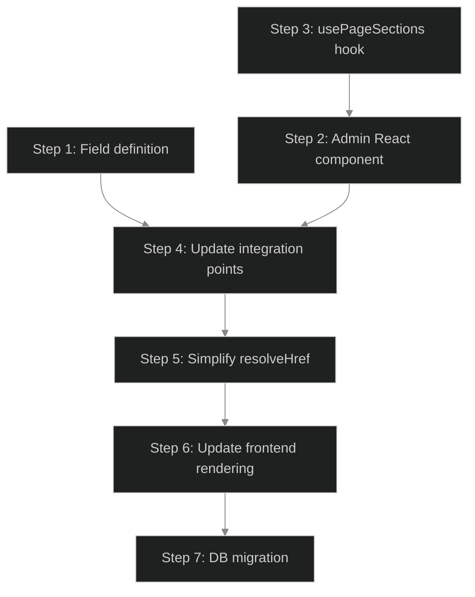
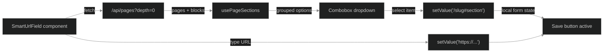

# Implementation Plan: Smart URL Field — Admin UI Redesign

## Spec Reference
Link to: `../spec.md`

## Documentation Research
Link to: `docs-research.md`

Key findings:
- Payload v3 custom fields use `admin.components.Field` with a string path — component auto-registered in importMap
- `useField<string>({ path })` from `@payloadcms/ui` provides `{ value, setValue }` for local form state (no DB write)
- Client components fetch data via REST API (`/api/pages`), not `usePayload()`
- `blockName` is available on all blocks by default (user-editable label in Payload)
- No testing libraries in the project — test plan from spec is out of scope

## Codebase Context

**Current state**: `smartLinkFields()` in `smart-link.ts` returns 3 Payload fields spread into parent groups. Used in 5 files across 8 call sites. Frontend resolves structured data to href via `resolveHref()`.

**Key patterns discovered:**
- All integration points use `...smartLinkFields()` spread — replacement is mechanical
- `resolveHref()` is called in 5 frontend components, always as `resolveHref(someObject)`
- `Button` component renders `<a>` when `href` is provided — no Next.js `<Link>` used anywhere currently
- Section IDs in DOM use `toKebabCase(block.blockType)` — fragment in stored URL must match this
- `openInNewTab` checkbox exists on hero and cta blocks — will keep working alongside new field
- The project uses `lucide-react`, `cva`, `clsx`, `tailwind-merge` — available for the component UI

## Steps Overview

| # | Step | File | Status |
|---|------|------|--------|
| 1 | Create `smartUrlField()` field definition | `step-01.md` | ✅ Approved |
| 2 | Create `SmartUrlField` admin React component | `step-02.md` | ✅ Approved |
| 3 | Create `usePageSections` data-fetching hook | `step-03.md` | ✅ Approved |
| 4 | Update all integration points (5 files, 8 sites) | `step-04.md` | ✅ Approved |
| 5 | Simplify `resolveHref()` to passthrough | `step-05.md` | ✅ Approved |
| 6 | Update frontend link rendering | `step-06.md` | ✅ Approved |
| 7 | Generate DB migration — drop old columns | `step-07.md` | ✅ Approved |
| 8 | Set up testing infrastructure | `step-08.md` | ✅ Approved |

**All 8 steps approved.**

## Dependencies Between Steps
- Step 3 must be done before Step 2 (hook is imported by component)
- Steps 1 and 3 can be done in parallel (independent)
- Step 4 requires Steps 1 + 2 (needs both field definition and component)
- Step 5 requires Step 4 (old resolveHref callers must be updated first)
- Step 6 requires Step 5 (rendering depends on new href format)
- Step 7 requires Step 4 (migration generated after schema changes; run after all code is ready)

## Refactoring Notes
- `smartLinkFields()` returns `Field[]` (array of 3 fields inside a row). New `smartUrlField()` returns a single `Field` — integration sites change from `...smartLinkFields()` to `smartUrlField()`
- `resolveHref()` currently accepts `SmartLinkData` (object with linkType/url/section). New version accepts `string | null | undefined` and returns it as-is or `"#"` fallback
- Frontend components currently pass `block.ctaButton ?? {}` to `resolveHref()`. After change, they pass `block.ctaButton?.url ?? "#"` (just the string field)

## Risk Areas
- **Import map regeneration**: The custom component path must be correct — Payload auto-generates `importMap.js` on build/dev. If the path is wrong, the field won't render.
- **REST API response shape**: Need to verify that `/api/pages?depth=0` includes `blocks` array with `blockType` and `blockName`. If `depth=0` strips blocks, may need `depth=1`.
- **Payload admin CSS**: The custom component renders inside Payload's admin UI which has its own styles. Need to ensure the combobox doesn't conflict with Payload's CSS reset/scoping.
