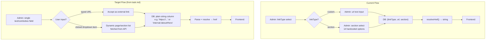
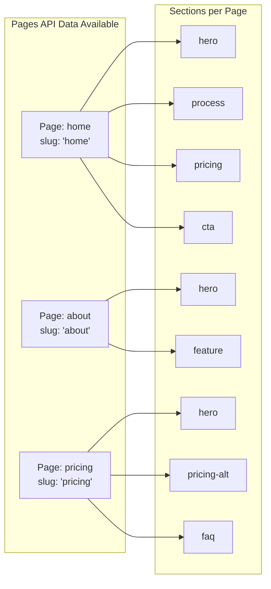

# Research: Smart URL Field — Current State & Available Infrastructure

## Summary

The project uses a reusable `smartLinkFields()` function that generates standard Payload CMS fields (select + text + select) with conditional rendering. It provides two modes: external URL input and internal section selector from a **hardcoded list of 14 sections**. The field stores structured data (`linkType`, `url`, `section`) across multiple DB columns within block/global groups, then resolves to a plain href string on the frontend via `resolveHref()`.

The task requirements call for a fundamentally different approach: a **single text field** storing a plain string (`internal:/about#section` or `https://...`), with a **custom admin UI component** featuring a combobox/autocomplete that dynamically loads all available pages and sections. Currently, **no custom field UI components exist** in the project — all admin UI is auto-generated from standard Payload field definitions. Payload v3.75.0 is used.

## Detailed Findings

### 1. Current Smart-Link Field Definition

- **Location**: `apps/landing/shared/collections/fields/smart-link.ts`
- **Pattern**: Function returning `Field[]` (not a custom field type)
- **Structure**: A `row` containing 3 fields:
  - `linkType` (select, 30% width) — "custom" or "section"
  - `url` (text, 70% width) — shown when linkType = "custom"
  - `section` (select, 70% width) — shown when linkType = "section"
- **Section options**: Hardcoded array of 14 values with Ukrainian labels (lines 3-18)
- **Conditional logic**: Uses `admin.condition` on sibling data to toggle visibility

```typescript
// Current data model (multiple fields/columns):
{ linkType: "custom", url: "https://example.com", section: null }
{ linkType: "section", url: null, section: "hero" }

// Target data model from task (single string):
"https://example.com"
"internal:/about#hero"
"internal:/about"
```

### 2. Where Smart-Link Is Used (6 integration points)

| Block/Global | File | Line | Context |
|---|---|---|---|
| HeroBlock | `shared/collections/blocks/hero-block.ts` | 73 | ctaButton group |
| ProcessBlock | `shared/collections/blocks/process-block.ts` | 152 | tabs array items |
| CtaBlock | `shared/collections/blocks/cta-block.ts` | 68 | ctaButton group |
| FooterBlock | `shared/collections/blocks/footer-block.ts` | 88, 123 | menuGroups.links, newsletter |
| Header (global) | `shared/collections/globals/header.ts` | 51, 73, 89 | navLinks, children, cta |

All use the spread pattern: `...smartLinkFields()`

### 3. Link Resolution on Frontend

- **Location**: `features/payload-page/lib/resolve-href.ts`
- **Function**: `resolveHref(link: SmartLinkData): string`
- **Logic**:
  - `linkType === "section"` → `#${section}` (e.g., `#hero`)
  - `linkType === "custom"` → `url` value as-is
  - Fallback for legacy field names: `href`, `buttonLink`, `buttonHref`, `ctaLink`
- **Used in**: hero-block.tsx, cta-block.tsx, process-block.tsx, site-header.tsx, footer-block.tsx

### 4. Section ID Generation on Frontend

- **Location**: `features/payload-page/ui/render-blocks.tsx:21-23, 71-77`
- **Logic**: Each block renders inside `<div id={toKebabCase(block.blockType)}>`, where `toKebabCase` converts camelCase to kebab-case
- **Generated IDs**: `hero`, `process`, `pricing`, `pricing-alt`, `feature`, `integration`, `testimonial`, `faq`, `cta`, `blog`, `footer`, `partnership`, `gallery`, `contact-us`
- **Important**: Section IDs are derived from `blockType`, NOT from any user-configurable field. A page can have multiple blocks of the same type — only the first gets a unique anchor.
- **Critical distinction**: Section **type** (blockType) ≠ section **name** (label). For example, a `process` block can appear twice on the same page with completely different labels. In Payload CMS, each block instance already has its own label/title field — the dropdown should display these user-given names (not just the block type) to distinguish between multiple blocks of the same type on a page.

### 5. Pages Collection Structure

- **Location**: `shared/collections/pages.ts`
- **Key fields for link picker**:
  - `title` (text, localized, required) — display name
  - `slug` (text, unique, required) — URL path segment
  - `blocks` (blocks array, required, min 1) — each block has `blockType`
- **Access**: Publicly readable
- **Localization**: 3 locales (en, uk, ru) with fallback enabled

### 6. Custom Admin UI Patterns (None Exist)

- **Payload version**: v3.75.0
- **Admin import map** (`app/(payload)/admin/importMap.js`): Only `S3ClientUploadHandler` and `CollectionCards`
- **No custom field components**: No `admin.components.Field` registrations found
- **No `useField`/`useFieldType` usage**: All fields use standard Payload UI
- **Implication**: Building a custom field UI component will be the first of its kind in this project

### 7. Available Block Types (14 total)

| blockType (camelCase) | Section ID (kebab-case) | Label (UK) |
|---|---|---|
| hero | hero | Головна секція |
| process | process | Процес |
| pricing | pricing | Ціни |
| pricingAlt | pricing-alt | Ціни (альт.) |
| feature | feature | Можливості |
| integration | integration | Інтеграції |
| testimonial | testimonial | Відгуки |
| faq | faq | Питання та відповіді |
| cta | cta | Заклик до дії |
| blog | blog | Блог |
| footer | footer | Футер |
| partnership | partnership | Партнерство |
| gallery | gallery | Галерея |
| contactUs | contact-us | Контакти |

## Code References

- `smart-link.ts:3-18` — hardcoded SECTION_OPTIONS array
- `smart-link.ts:20-69` — smartLinkFields() function
- `resolve-href.ts:12-23` — resolveHref() link resolution
- `render-blocks.tsx:21-23` — toKebabCase section ID generation
- `render-blocks.tsx:71-77` — section ID applied to DOM
- `pages.ts:39-62` — slug field definition
- `pages.ts:64-90` — blocks field definition

## Architecture Insights

- **Current pattern**: Multi-field structured data → resolve at render time
- **Target pattern**: Single plain-text field → parse at render time
- **Key gap**: No mechanism to dynamically fetch pages + sections in admin UI
- **Key gap**: No custom React components in admin panel yet
- **Key gap**: Current format stores `linkType`/`url`/`section` separately; new format needs `internal:/slug#section` as single string




